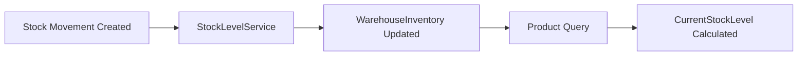

# Stock Management Guide

## Overview

This guide explains how stock/inventory management works in the SaaS Billing + Inventory system and clarifies the correct approach for tracking and updating inventory levels.

## Architecture

The system uses a **movement-based inventory tracking** approach with the following components:

### 1. WarehouseInventory (Source of Truth)
- **Table**: `WarehouseInventory`
- **Purpose**: Tracks the actual quantity of each product in each warehouse
- **Updated by**: Stock movements only
- **Fields**:
  - `ProductId` - Which product
  - `WarehouseId` - Which warehouse
  - `Quantity` - Current physical quantity in warehouse
  - `ReservedQuantity` - Quantity reserved for orders (future feature)
  - `AvailableQuantity` - Calculated as `Quantity - ReservedQuantity`

### 2. StockMovement (Transaction Log)
- **Table**: `StockMovements`
- **Purpose**: Records all inventory transactions
- **Types**: InitialInventory, Purchase, Sale, Transfer, Adjustment, Return
- **Effect**: Each movement automatically updates `WarehouseInventory` via `StockLevelService`

### 3. Product.CurrentStockLevel (Deprecated)
- **Status**: ⚠️ **DEPRECATED** - Do not use for updates
- **Purpose**: Legacy field kept for backward compatibility
- **Calculated**: Total stock across all warehouses (read-only)
- **Note**: This field is NOT updated when you edit a product

## How Stock Tracking Works



### Flow:
1. **Create a Stock Movement** (Purchase, Sale, Transfer, etc.)
2. **StockLevelService** processes the movement
3. **WarehouseInventory** is updated automatically
4. **Product Queries** calculate total stock from WarehouseInventory
5. **CurrentStockLevel** in DTO shows calculated total

## Correct Approach: Stock Updates

### ✅ DO: Use Stock Movements

**To change inventory**, create a `StockMovement`:

```csharp
POST /api/v1/stock-movements
{
  "productId": "guid",
  "warehouseId": "guid",
  "movementType": 1,  // Purchase
  "quantity": 100,
  "unitCost": 25.00,
  "reference": "PO-12345",
  "notes": "Stock delivery",
  "movementDate": "2024-02-09"
}
```

**Available Movement Types**:
- `0` - InitialInventory: First-time stock setup
- `1` - Purchase: Receiving from supplier (adds stock)
- `2` - Sale: Selling to customer (removes stock)
- `3` - Transfer: Moving between warehouses
- `4` - Adjustment: Manual corrections (can add or remove)
- `5` - Return: Customer returns (adds stock)

### ❌ DON'T: Update Product.CurrentStockLevel Directly

**This will NOT work** (field is ignored):

```csharp
PUT /api/v1/products/{id}
{
  "currentStockLevel": 150  // ❌ This is ignored!
}
```

The `CurrentStockLevel` field:
- Is **NOT included** in `UpdateProductCommand`
- Is **calculated** from `WarehouseInventory` when querying products
- Is **read-only** in the frontend edit form
- Is **deprecated** and marked with `[Obsolete]` attribute

## Setting Initial Stock

### When Creating a Product

Use `InitialQuantity` and `InitialWarehouseId` (recommended):

```json
POST /api/v1/products
{
  "name": "Laptop",
  "code": "LAP-001",
  "sku": "SKU-LAP-001",
  "unitPrice": 1500.00,
  "costPrice": 1200.00,
  "minimumStockLevel": 5,
  "initialQuantity": 25,           // ✅ Recommended
  "initialWarehouseId": "guid",    // ✅ Recommended
  "isActive": true
}
```

**What happens**:
1. Product is created
2. A `StockMovement` is automatically created with type `InitialInventory`
3. `WarehouseInventory` is updated for that warehouse
4. Product queries return correct stock level

### Alternative: Manual Stock Movement

After creating a product, you can also add stock manually:

```json
POST /api/v1/stock-movements
{
  "productId": "new-product-id",
  "warehouseId": "warehouse-id",
  "movementType": 0,  // InitialInventory
  "quantity": 25,
  "unitCost": 1200.00
}
```

## Frontend Usage

### Product List Page
- Displays `currentStockLevel` calculated from all warehouses
- Shows total inventory across the organization

### Product Edit Page
- `Current Stock Level` field is **disabled** (read-only)
- Shows a hint: "Stock level is calculated from warehouse inventory. Use Stock Movements to change inventory."
- Does NOT send `currentStockLevel` when saving

### Product Create Page
- Shows `Initial Quantity` field (optional)
- Shows `Initial Warehouse` dropdown (required if quantity is set)
- Automatically creates stock movement on product creation

### Stock Movements Page
- Use this to add, remove, or adjust inventory
- All inventory changes should go through this interface

## Multi-Warehouse Inventory

### Per-Warehouse Stock Levels

Query warehouse inventory to see stock per location:

```csharp
GET /api/v1/warehouse-inventory?productId={guid}
```

Response:
```json
[
  {
    "productId": "guid",
    "warehouseId": "warehouse-1",
    "warehouseName": "Main Warehouse",
    "quantity": 50,
    "availableQuantity": 50
  },
  {
    "productId": "guid",
    "warehouseId": "warehouse-2",
    "warehouseName": "Distribution Center",
    "quantity": 75,
    "availableQuantity": 75
  }
]
```

### Transferring Stock Between Warehouses

Use movement type `Transfer`:

```json
POST /api/v1/stock-movements
{
  "productId": "guid",
  "warehouseId": "source-warehouse",           // From
  "destinationWarehouseId": "dest-warehouse",   // To
  "movementType": 3,                            // Transfer
  "quantity": 20,
  "notes": "Rebalancing stock"
}
```

**Effect**:
- Removes 20 from source warehouse
- Adds 20 to destination warehouse
- Both `WarehouseInventory` records are updated

## Common Scenarios

### Scenario 1: Receiving Stock from Supplier

```json
POST /api/v1/stock-movements
{
  "productId": "product-guid",
  "warehouseId": "receiving-warehouse",
  "movementType": 1,        // Purchase
  "quantity": 100,
  "unitCost": 50.00,
  "totalCost": 5000.00,
  "reference": "PO-2024-001",
  "notes": "Supplier: ACME Corp"
}
```

### Scenario 2: Selling Product to Customer

```json
POST /api/v1/stock-movements
{
  "productId": "product-guid",
  "warehouseId": "warehouse-guid",
  "movementType": 2,        // Sale
  "quantity": -5,           // Negative to remove
  "reference": "INV-2024-123",
  "notes": "Customer order"
}
```

### Scenario 3: Stock Adjustment (Damage, Loss, Found)

```json
POST /api/v1/stock-movements
{
  "productId": "product-guid",
  "warehouseId": "warehouse-guid",
  "movementType": 4,        // Adjustment
  "quantity": -3,           // Lost 3 items
  "notes": "Damaged during inspection"
}
```

### Scenario 4: Customer Return

```json
POST /api/v1/stock-movements
{
  "productId": "product-guid",
  "warehouseId": "warehouse-guid",
  "movementType": 5,        // Return
  "quantity": 2,
  "reference": "RMA-2024-045",
  "notes": "Customer return - defective"
}
```

## Data Consistency

### Automatic Updates

The `StockLevelService` ensures:
1. Every stock movement updates `WarehouseInventory`
2. Updates are transactional (all-or-nothing)
3. Inventory levels stay accurate

### Query Behavior

When querying products:
- `GET /api/v1/products/{id}` calculates stock from `WarehouseInventory`
- `GET /api/v1/products` calculates stock for each product
- Stock is always current and accurate

### Validation

Stock movements are validated:
- Product must exist
- Warehouse must exist and belong to tenant
- For transfers, destination warehouse is required
- Quantities must be non-zero
- Multi-tenant isolation is enforced

## Migration Notes

### For Existing Code

If you have code that sets `Product.CurrentStockLevel`:

**Before (❌ Deprecated)**:
```csharp
product.CurrentStockLevel = 100;
await _unitOfWork.SaveChangesAsync();
```

**After (✅ Correct)**:
```csharp
var movement = new StockMovement
{
    ProductId = product.Id,
    WarehouseId = warehouseId,
    MovementType = MovementType.Adjustment,
    Quantity = 100,
    Notes = "Stock update"
};
await _unitOfWork.StockMovements.AddAsync(movement);
await _stockLevelService.UpdateStockLevelsAsync(movement);
await _unitOfWork.SaveChangesAsync();
```

### Database Schema

The `CurrentStockLevel` column in the `Products` table:
- Still exists for backward compatibility
- Is not updated by product update operations
- Can be removed in a future major version
- Is marked with `[Obsolete]` in code

## Best Practices

1. ✅ **Always use stock movements** to change inventory
2. ✅ **Set initial stock** using `InitialQuantity`/`InitialWarehouseId` when creating products
3. ✅ **Reference external documents** in the `Reference` field (PO numbers, invoice numbers, etc.)
4. ✅ **Add notes** to explain why adjustments were made
5. ✅ **Use appropriate movement types** to maintain clear audit trail
6. ❌ **Never try to update** `Product.CurrentStockLevel` directly
7. ❌ **Don't bypass** the stock movement system

## API Endpoints Reference

### Stock Movements
- `GET /api/v1/stock-movements` - List all movements
- `GET /api/v1/stock-movements/{id}` - Get movement details
- `POST /api/v1/stock-movements` - Create movement (updates inventory)
- `PUT /api/v1/stock-movements/{id}` - Update movement
- `DELETE /api/v1/stock-movements/{id}` - Delete movement (reverses inventory change)

### Warehouse Inventory
- `GET /api/v1/warehouse-inventory` - List inventory levels
- `GET /api/v1/warehouse-inventory?productId={id}` - Get inventory for specific product
- `GET /api/v1/warehouse-inventory?warehouseId={id}` - Get inventory for specific warehouse

### Products
- `GET /api/v1/products` - List products (includes calculated stock)
- `GET /api/v1/products/{id}` - Get product (includes calculated stock)
- `POST /api/v1/products` - Create product (with optional initial stock)
- `PUT /api/v1/products/{id}` - Update product (stock field is ignored)

## Troubleshooting

### Stock Level Not Updating

**Problem**: Changed stock but product still shows old quantity

**Solution**: 
1. Check if stock movement was created successfully
2. Verify `WarehouseInventory` was updated
3. Ensure you're querying the product (which calculates from warehouse inventory)
4. Check for any errors in `StockLevelService`

### Initial Stock Not Set

**Problem**: Created product with `initialQuantity` but stock is 0

**Solution**:
1. Verify `initialWarehouseId` was provided
2. Check that warehouse exists and belongs to your tenant
3. Look for stock movement with type `InitialInventory`
4. Check backend logs for warnings

### Stock Showing Wrong Total

**Problem**: Total stock doesn't match sum of warehouses

**Solution**:
1. Query warehouse inventory: `GET /api/v1/warehouse-inventory?productId={id}`
2. Sum the quantities manually
3. Compare with product's `currentStockLevel`
4. If mismatch, check for soft-deleted warehouses or movements

## Summary

- **Stock is tracked** per warehouse in `WarehouseInventory`
- **Stock is changed** via `StockMovement` transactions
- **Product.CurrentStockLevel** is calculated (read-only)
- **Never update** stock directly on Product entity
- **Always use** the stock movements system

---

**Last Updated**: February 2024  
**Version**: 1.0  
**Status**: Active
